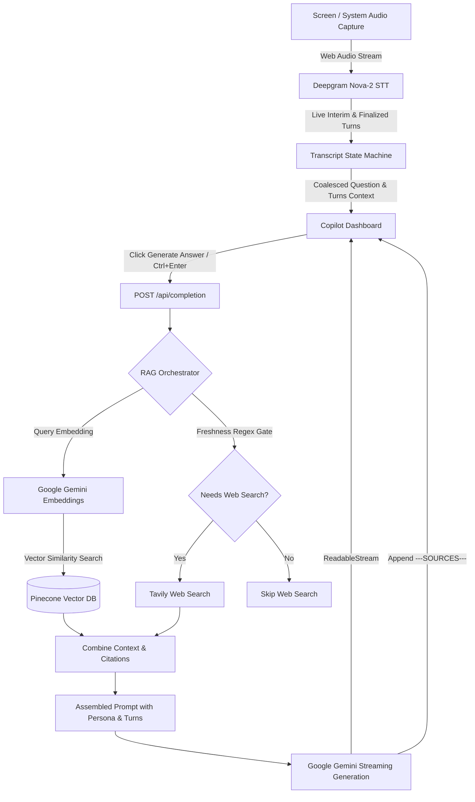

# AI Interview Copilot 🎙️🤖

<p align="center">
  
  
  
  
  
  
  
</p>

---

## 📌 Overview

**AI Interview Copilot** is a high-performance, real-time telemetry and context assistant designed for technical interviews. It captures interviewer audio via browser screen/system share, performs live speech-to-text with Deepgram Nova-2, dynamically retrieves relevant context from uploaded PDF knowledge bases (via Pinecone RAG) and real-time web search (via Tavily), and streams structured, actionable answers with Google Gemini.

---

## ✨ Key Features

### 🎙️ Real-Time Audio Transcription & State Machine
- **Deepgram Nova-2 Integration:** Real-time speech recognition capturing system/interviewer audio with millisecond latency.
- **Zero-Polling Transcript State Machine:** Utterances are managed in an event-driven state machine that handles interim hypotheses, multi-utterance coalescing, and silence-based finalization.
- **Multi-Part Question Resolution:** Intelligently gathers consecutive utterances from the interviewer into a unified question block so context is never lost when the speaker pauses.

### ⚡ Low-Latency Gemini Streaming
- **Real-Time Token Streaming:** Answers stream token-by-token directly into the UI with immediate Time-to-First-Token (TTFT).
- **Multi-Model Fallback Chain:** Automatic retry with exponential backoff across fallback models to guarantee high availability during API load spikes.
- **Concise & Structured Answers:** Prompts engineered for high-pressure interviews with bullet-pointed technical steps, trade-offs, and examples.

### 📚 Hybrid RAG (Vector Search + Routed Web Search)
- **PDF Document Ingestion:** Upload and index technical resumes, project whitepapers, or domain documents into Pinecone vector storage.
- **768-Dim Gemini Embeddings:** Semantic search matches the interviewer's question to specific PDF snippets and page numbers.
- **Deterministic Web Router:** Web search is gated by freshness signals (e.g., current versions, release dates, pricing), skipping redundant web lookups on standard algorithmic questions.
- **Interactive Citation Modal:** Click any citation badge to view matching PDF context snippets and page numbers.

### 🎛️ In-App Prompt & Persona Inspector
- **Custom System Directives:** View and adjust answer rules (word count, bullet points, technical depth) on the fly without editing code.
- **Candidate Persona & Background:** Store your tech stack, projects, and career summary; automatically injected into generation prompts.
- **Live Prompt Preview:** Inspect the exact assembled prompt string sent to Gemini in real time.
- **Persistent Storage:** Custom settings persist seamlessly in `localStorage`.

### 🛡️ Stealth Mode & Keyboard Shortcuts
- **Stealth Mode (`Ctrl+Shift+C`):** Minimizes the copilot into an unobtrusive icon for distraction-free interviews.
- **Fast Keyboard Navigation:**
  - `Ctrl + Enter`: Trigger instant answer generation.
  - `Ctrl + C`: Switch to Copilot Mode.
  - `Ctrl + S`: Switch to Summarizer Mode.

---

## 🏗️ System Architecture



---

## 📁 Repository Structure

```
AI-powererd-interview-Assistant/
├── app/
│   ├── api/
│   │   ├── completion/        # Streaming LLM completion & RAG dispatch
│   │   ├── deepgram/          # STT session authentication
│   │   ├── pdf/               # PDF upload, parsing, and vector indexing
│   │   ├── rag/               # Vector similarity query endpoint
│   │   └── sessions/          # Session transcript persistence
│   ├── globals.css            # Tailwind & global design tokens
│   ├── layout.tsx             # Root layout with dark mode
│   └── page.tsx               # Entry page routing to interview dashboard
├── components/
│   ├── ui/                    # Reusable Radix UI & Tailwind components
│   ├── ChatTranscription.tsx  # Live conversation stream view
│   ├── copilot.tsx            # Split-view copilot dashboard & trigger bar
│   ├── History.tsx            # Saved responses & session drawer
│   ├── PDFManager.tsx         # Document upload & Pinecone index manager
│   ├── PDFModal.tsx           # PDF page and context citation viewer
│   ├── PromptModal.tsx        # System prompt, persona, and live preview modal
│   └── recorder.tsx           # Screen/system audio capture controls
├── lib/
│   ├── agents/
│   │   ├── localQuestionExtractor.ts  # Regex fallback query generator
│   │   ├── pineconeService.ts         # Pinecone index management & vector query
│   │   ├── ragOrchestrator.ts         # RAG pipeline & web search routing
│   │   └── simpleWebSearchAgent.ts    # Tavily search wrapper
│   ├── audio/
│   │   ├── audioTransportService.ts   # Audio worklet & stream handling
│   │   └── keyterms.ts                # Technical keywords for Deepgram boosting
│   ├── gemini.ts              # Google GenAI SDK configuration
│   ├── safePdfParse.ts        # Robust PDF text parser
│   ├── sessionManager.ts      # Active session & sliding transcript manager
│   ├── transcriptStateMachine.ts # Zero-polling utterance state machine
│   ├── types.ts               # Shared TypeScript interfaces
│   └── utils.ts               # Prompt templates & class merge utilities
├── public/                    # Static UI assets
├── scripts/
│   ├── setup-pinecone-index.js # One-click Pinecone index creator
│   └── verify-setup.js         # API key and environment verification
├── package.json
├── tailwind.config.ts
└── tsconfig.json
```

---

## 🚀 Getting Started

### 1. Prerequisites
- **Node.js** 18.17+ or 20+
- **npm** (or yarn / pnpm)
- API Keys for:
  - [Google AI Studio](https://aistudio.google.com/) (`GEMINI_API_KEY`)
  - [Deepgram](https://deepgram.com/) (`DEEPGRAM_API_KEY`)
  - [Pinecone](https://www.pinecone.io/) (`PINECONE_API_KEY`)
  - [Tavily AI](https://tavily.com/) (`TAVILY_API_KEY`)

---

### 2. Installation

Clone the repository and install dependencies:

```bash
git clone https://github.com/abhishekj44/AI-Assistant.git
cd AI-Assistant
npm install
```

---

### 3. Configure Environment Variables

Create a `.env` file in the root directory (or copy from `.env.example`):

```bash
cp .env.example .env
```

Fill in your configuration:

```env
# Audio transcription (Deepgram)
DEEPGRAM_API_KEY="your-deepgram-api-key"

# Gemini LLM & Embeddings
GEMINI_API_KEY="your-gemini-api-key"
GEMINI_MODEL="gemini-2.5-flash"

# Vector Database (Pinecone RAG)
PINECONE_API_KEY="your-pinecone-api-key"
PINECONE_INDEX_NAME="interview-docs"

# Real-time Web Search (Tavily)
TAVILY_API_KEY="your-tavily-api-key"
```

---

### 4. Setup Pinecone Vector Index

Initialize your Pinecone vector index (dimension `768`, metric `cosine`):

```bash
npm run setup-pinecone
```

Verify your environment and connectivity:

```bash
npm run verify-setup
```

---

### 5. Run the Development Server

```bash
npm run dev
```

Open [http://localhost:3000](http://localhost:3000) in your browser.

---

## 💡 How to Use

1. **Connect Audio:** Click **Connect** in the Audio Stream panel and select the browser tab or window where your interview/meeting is running. Make sure **"Share tab audio"** or **"Share system audio"** is checked.
2. **Upload Reference Docs (Optional):** In the **Knowledge Base** section, upload your resume or technical reference PDFs to enable vector-augmented answers.
3. **Configure Persona (Optional):** Click **Prompt & Persona** in the top navigation bar to adjust candidate background or custom answer guidelines.
4. **Generate Answers:**
   - As the interviewer speaks, the live transcript is processed in real time.
   - When a question is asked, click **Generate Answer** (or press `Ctrl + Enter`).
   - The structured answer will stream in immediately, accompanied by citations if relevant PDF documents were matched.
5. **Stealth Mode:** Press `Ctrl + Shift + C` to minimize the interface during live screen sharing.

---

## 📜 License

This project is licensed under the **MIT License**.
